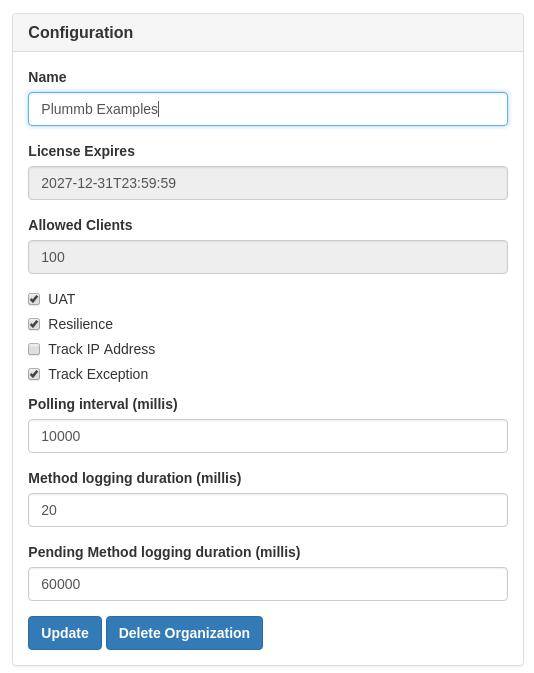
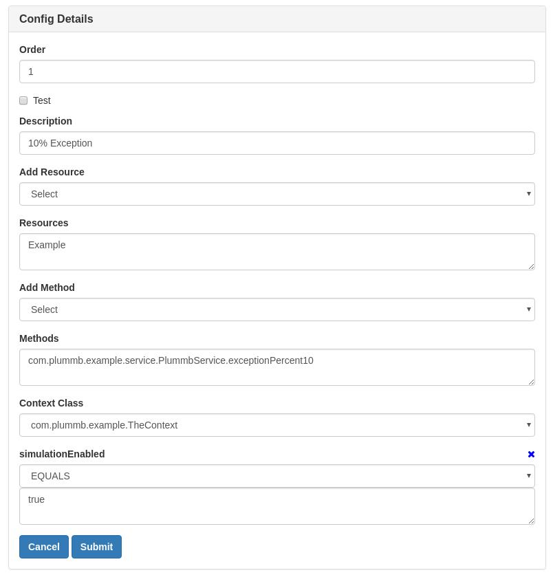
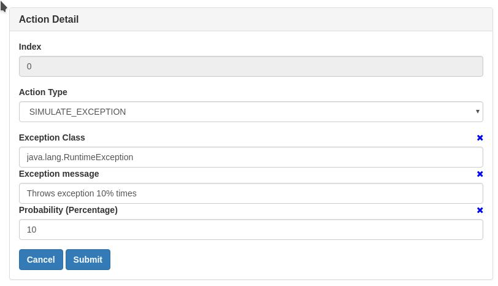
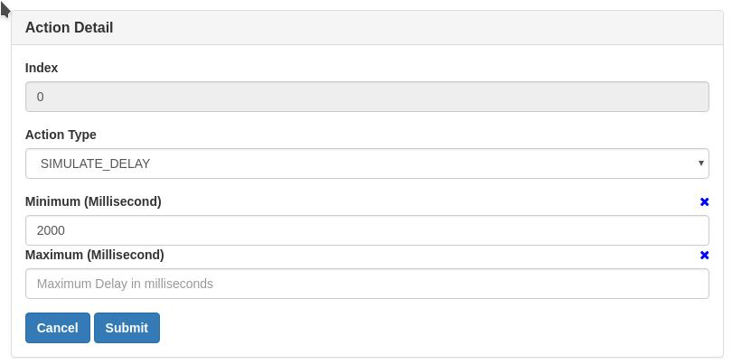
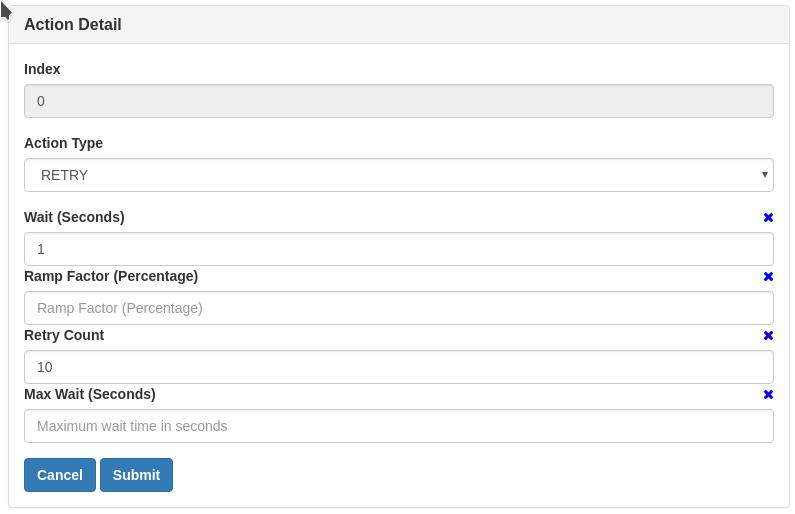
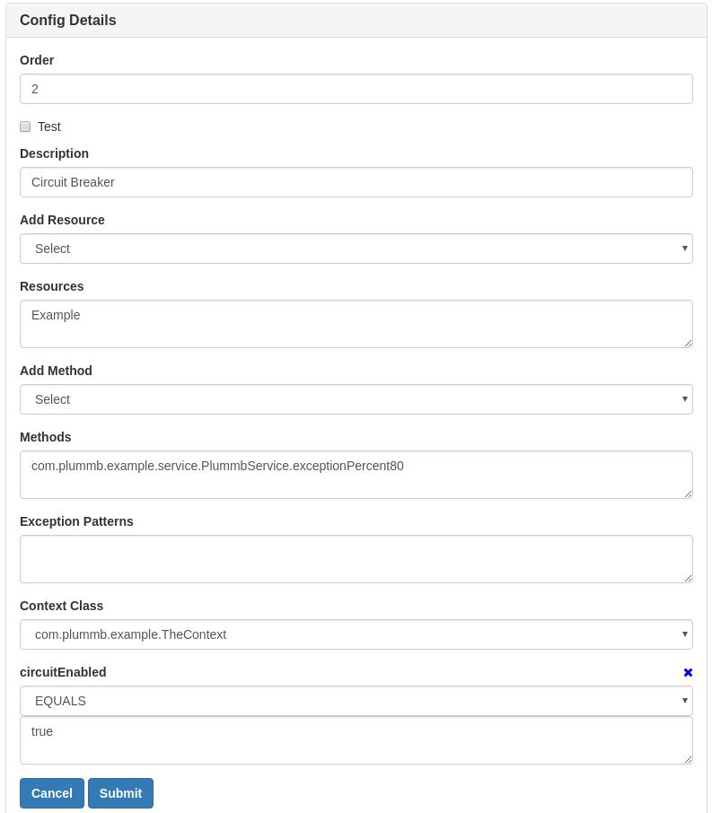
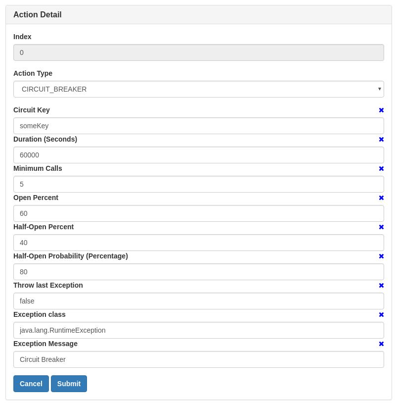
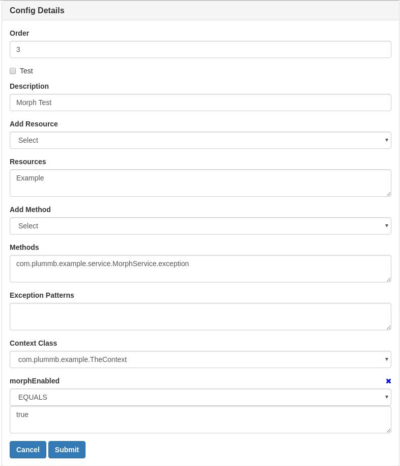
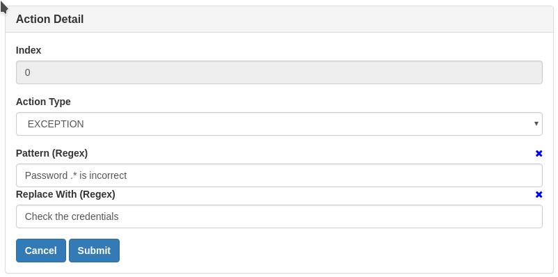

# README #

### What is this repository for? ###
* This demonstrates the power of Plummb. It also provides a way to play around with pre-configured rules.

## Features ##
* During UAT, certain actions can be Simulated, thus enabling proper testing.
    * Class - SimulationTest 
        * Delay Action
            * Introduce a delay in minutes before calling actual method.
        * Throw Exception Action
            * Throw a custom Exception before calling actual method.
* Certain actions can be introduced when an Exception is thrown.
    * Class - ResilienceTest
        * Retry Action
            * At times retrying a method succeeds when making a call network call.
    * Class - CircuitBreakerTest
        * Circuit Breaker Action
            * Closed Circuit
                * A call starts with a Closed Circuit
            * Open Circuit
                * When call failures cross an Open threshold, the circuit becomes Open. 
                Means at this time, configured Exception is thrown without calling actual method.
            * Half-Open Circuit
                * When call failures cross a Half-Open threshold, the circuit becomes Half-Open.
                Means only few percentage of times actual call is made, while an Exception is thrown for the rest. 
* An exception message can be modified. Especially helpful when the original exception contains some sensitive information.
    * Class - MorphingTest
        * Morphing a sensitive Exception message
* Logging the performance and depth of methods
    * Class - ExpensiveServiceTest
        * Method Logging
            * Emit information if a method has taken at least X milliseconds.
        * Pending Method Logging
            * Emit information if a method has been pending for at least X milliseconds and still executing.
        
## IP Tracking ##
* IP is NOT tracked for this account.
  
## Pre-requisites ##
* Java 7+
* Maven 3.3.9 or above

## How do I set it up? ##
* The project contains a bundled Plummb Jar file.
* Just clone the repository and execute mvn clean install

## Working with Latest Plummb Jar ##
* Login to www.plummb.com
* Download appropriate Plummb tar from Help link
* Follow the process to install Plummb Jar
* Remove 2 lines from pom.xml, as marked

## Playing Around ##
* TheContext is the object to play around. By default all are enabled.
    * Set simulationEnabled flag to enable/disable Simulation Rules 
    * Set resilienceEnabled flag to enable/disable Resilience Rules
    * Set circuitEnabled flag to enable/disable Circuit Breakers
    * Set morphEnabled flag to enable/disable Morphing
    * All settings can be viewed using [Guest](http://www.plummb.com/resile/login/guest) login

## Running Test Case against my account
* Sign In/Up at www.plummb.com
* Disclaimer: Below images may be obsolete. Login as [Guest](http://www.plummb.com/resile/login/guest) for latest configurations.
* Update "Organization Info" as shown  
    
* Click "Access Keys", an access key is already generated. 
    * Update accessKey in src/main/resources/plummbAgent.properties
* Execute mvn clean install.
    * This will fail presently.
    * This execution will help in filling the Drop Down for configuring Rules
* Create "Simulation Rule" as below 
    * Exception : Info and Action  
      
    
    * Delay : Info and Action  
      
    
* Create "Resilience Rule" as below
    * Retry : Info and Action  
      
    
    * Circuit Breaker : Info and Action  
      
    
    * Morph : Info and Action  
      
    
* Execute again mvn clean install
    * This time the test cases should succeed
        
### Who do I talk to? ###
* Repo owner : support@plummb.com
